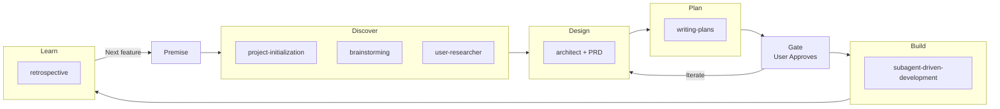

# ProjectForge — AI-Powered Project Lifecycle for OpenCode

Initialize, govern, and learn from every project with a repeatable lifecycle.

**Start every project or feature by invoking `forge`** — it orchestrates the full lifecycle automatically.

## Skills

| Skill | Purpose |
|---|---|
| **forge** | **START HERE.** Orchestrates the full lifecycle: discover → design → plan → gate → build → learn |
| **project-initialization** | Scaffold a new project with docs structure, ADR workflow, and lifecycle governance |
| **user-researcher** | Research industry-leading systems and user sentiment for any feature, categorized by priority |
| **architect** | Record every architectural decision, enforce continuity, verify deployability |
| **retrospective** | Learn from vibe-coding loops, keep docs current, propose automation |

## Workflow



## Installation

### 1. Register the plugin

Add to your `opencode.json`:

```json
{
  "plugin": ["D:\\code\\opencode-projectforge"]
}
```

### 2. Install the forge agent + command (one-time)

```powershell
copy install\forge-agent.md "$env:USERPROFILE\.config\opencode\agents\forge.md"
copy install\forge-command.md "$env:USERPROFILE\.config\opencode\commands\forge.md"
```

Restart OpenCode.

### 3. Use it

```
/forge build a second brain
```

The forge agent runs the full lifecycle automatically. No other skills to remember.

## License

MIT
