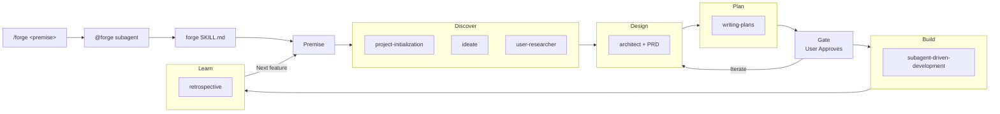

# productforge — AI-Powered Project Lifecycle for OpenCode

Initialize, govern, and learn from every project with a repeatable lifecycle.

**Start every project or feature by invoking `forge`** — it orchestrates the full lifecycle automatically.

## Skills

| Skill | Purpose |
|---|---|
| **forge** | **START HERE.** Orchestrates the full lifecycle: discover → design → plan → gate → build → learn |
| **project-initialization** | Scaffold a new project with docs structure, ADR workflow, and lifecycle governance |
| **ideate** | Refine rough ideas into clear designs with 3 autonomy levels: Drive (full auto), Guided (ask on conflict), Collaborate (co-create) |
| **user-researcher** | Research industry-leading systems and user sentiment for any feature, categorized by priority |
| **architect** | Record every architectural decision, enforce continuity, verify deployability |
| **retrospective** | Learn from vibe-coding loops, keep docs current, propose automation |

## Workflow



## Installation

### 1. Install the plugin

**Via git (recommended):**
```json
{
  "plugin": ["productforge@git+https://github.com/isaac/opencode-productforge.git"]
}
```

**Via local clone (development):**
```json
{
  "plugin": ["<path-to-cloned-repo>"]
}
```

### 2. Install the forge agent + command (one-time)

```powershell
# Windows
copy install\forge-agent.md "$env:USERPROFILE\.config\opencode\agents\forge.md"
copy install\forge-command.md "$env:USERPROFILE\.config\opencode\commands\forge.md"
```

```bash
# macOS / Linux
cp install/forge-agent.md ~/.config/opencode/agents/forge.md
cp install/forge-command.md ~/.config/opencode/commands/forge.md
```

Restart OpenCode.

### 3. Use it

```
/forge build a second brain
```

That's it. Here's what happens:

```
/forge build a second brain
  │
  ▼
forge.md (command) ── passes premise to ──► forge.md (subagent)
                                               │
                                               ▼
                                          forge SKILL.md
                                               │
                                               ▼
         ┌──────────────────────────────────────────────────┐
         │  AIPDLC Lifecycle                                │
         │                                                  │
         │  Phase 1: Discover                               │
         │    ├─ project-initialization (scaffold docs)     │
         │    ├─ ideate (refine design, choose autonomy)    │
         │    └─ user-researcher (market + sentiment)       │
         │  Phase 2: Design   ── architect (ADRs + PRD)     │
         │  Phase 3: Plan     ── writing-plans (tasks)      │
         │  Phase 4: Gate     ── you approve or iterate     │
         │  Phase 5: Build    ── subagents execute          │
         │  Phase 6: Learn    ── retrospective (automate)   │
         └──────────────────────────────────────────────────┘
```

No other skills to remember — `/forge` is the sole entry point.

### 4. Choose your ideation style

When `forge` invokes the `ideate` skill, you'll be asked how you want to collaborate:

- **Drive** — full autonomy, agent designs end-to-end, you see the final spec
- **Guided** (default) — agent moves fast on clear decisions, asks on conflict/ambiguity
- **Collaborate** — full partnership, discuss everything together, co-create with visual companion

## License

MIT
