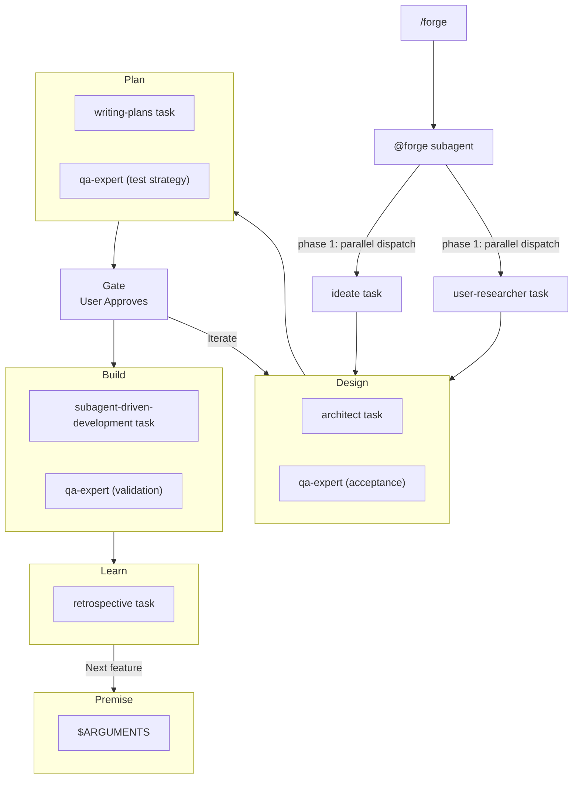

# productforge — AI-Powered Project Lifecycle for OpenCode

Initialize, govern, and learn from every project with a repeatable lifecycle.

**Start every project or feature by invoking `forge`** — it orchestrates the full lifecycle automatically.

## Skills

| Skill | Purpose |
|---|---|
| **forge** | **START HERE.** Orchestrates the full lifecycle: discover → design → plan → gate → build → learn |
| **project-initialization** | Scaffold a new project with docs structure, ADR workflow, and lifecycle governance |
| **ideate** | Refine rough ideas into clear designs with 3 autonomy levels: Drive (full auto), Guided (ask on conflict), Collaborate (co-create) |
| **user-researcher** | Research industry-leading systems and user sentiment for any feature, categorized by priority |
| **architect** | Record every architectural decision, enforce continuity, verify deployability |
| **qa-expert** | Define acceptance criteria, test strategy, and validate implementation quality at each phase |
| **retrospective** | Learn from vibe-coding loops, keep docs current, propose automation |

## Workflow



## Installation

Add productforge to the `plugin` array in your `opencode.json` (global or project-level):

**Via git (recommended):**
```json
{
  "plugin": ["opencode-productforge@git+https://github.com/neoaisac/opencode-productforge.git"]
}
```

**Via local path (development):**
```json
{
  "plugin": ["<path-to-cloned-repo>"]
}
```

**Via npm (once published):**
```json
{
  "plugin": ["opencode-productforge"]
}
```

Restart OpenCode. The plugin auto-installs via Bun, registers all skills, and deploys the `/forge` command and `@forge` subagent.

### Use it

```
/forge build a second brain
```

That's it. Here's what happens:

```
/forge build a second brain
  │
  ▼
forge.md (command) ── passes premise to ──► forge.md (subagent)
                                               │
                            ┌──────────────────┼──────────────────┐
                            ▼                  ▼                   ▼
                    ideate task        user-researcher      (Phase 1)
                    (design doc)       (market research)     parallel
                            │                  │
                            └──────┬───────────┘
                                   ▼
            ┌──────────────────────┼──────────────────────┐
            ▼                      ▼                      ▼
     architect task          qa-expert task          (Phase 2)
     (ADRs + PRD)            (acceptance criteria)    parallel
            │                      │
            └──────────┬───────────┘
                       ▼
            ┌──────────────────────┼──────────────────────┐
            ▼                      ▼                      ▼
     writing-plans task      qa-expert task          (Phase 3)
     (impl plan)             (test strategy)         sequential
            │                      │
            └──────────┬───────────┘
                       ▼
                      [GATE]                 (Phase 4)
                     you approve?
                     ├─ Yes → Build
                     ├─ No  → stop
                     └─ Iterate → refine
                       │
            ┌──────────┼───────────┐
            ▼          ▼           ▼
 subagent-driven-dev  qa-expert   (Phase 5)
 (one subagent/task)  (validation) parallel
            │          │
            └──────────┘
                       ▼
                retrospective          (Phase 6)
                (automate gaps)
```

No other skills to remember — `/forge` is the sole entry point.

### 4. How it works

The forge orchestrator runs the full lifecycle autonomously. Each phase dispatches a fresh subagent that loads the relevant skill and executes its process. You only interact at the **Gate** (Phase 4), where you approve the design, request iterations, or stop.

- **Phase 1-3** — fully autonomous research, design, and planning
- **Phase 4 (Gate)** — you review ADRs, PRD, plan, acceptance criteria, and test strategy; decide next steps
- **Phase 5-6** — autonomous build and retrospective

## License

MIT