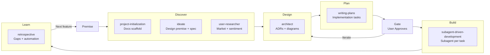

# Forge — ProjectLifecycle Orchestrator

Given a premise (project idea, feature request, problem statement), runs the full AIPDLC lifecycle by invoking the appropriate skills and agents in sequence. This is the single entry point — you do not need to invoke other skills manually.

## The Lifecycle

## When to Use

**Invoke this skill FIRST** whenever someone says:
- "I want to build X"
- "We need to add Y feature"
- "Let's start a new project"
- Any project scaffolding, design, or implementation request

Do NOT manually invoke project-initialization, ideate, user-researcher, architect, or writing-plans — those are called by this orchestrator as needed.

## Reference: Lifecycle Overview

This lifecycle is automated by the `/forge` command and `@forge` subagent. The subagent's instructions define each phase — you do not need to follow this document manually.

### Phase 1: Discover

- **ideate** — Refines premise into a design doc at `docs/features/<topic>-design.md`
- **user-researcher** — Researches market and user sentiment

### Phase 2: Design

- **architect** — Writes ADRs for all decisions, produces PRD at `docs/prds/YYYY-MM-DD-feature-name.md`
- **qa-expert** — Reviews PRD, defines acceptance criteria at `docs/features/<topic>-acceptance.md`

### Phase 3: Plan

- **writing-plans** — Breaks PRD into implementation tasks at `docs/plans/YYYY-MM-DD-feature-name.md`
- **qa-expert** — Reviews plan, produces test strategy at `docs/features/<topic>-test-strategy.md`

### Phase 4: Decision Gate

The forge subagent presents ADRs, PRD, plan, acceptance criteria, and test strategy, then asks for user approval.

### Phase 5: Build

- **subagent-driven-development** — Executes each task via fresh subagents with per-task review
- **qa-expert** — Validates test changes per task, verifies acceptance criteria met

### Phase 6: Learn

- **retrospective** — Identifies gaps, updates docs, proposes automation

## Key Principles

- **Single entry point**: The user only invokes `/forge`. The subagent orchestrates all phases.
- **Gate before build**: Never proceed to implementation without explicit user approval.
- **Parallel where possible**: Phase 1 runs ideate and user-researcher concurrently. Phase 2 runs architect and qa-expert concurrently.
- **Subagents load their own skills**: Each phase dispatches a `task` subagent that loads the relevant skill via the `skill` tool.
- **Failures → retrospective**: If a skill's output is rejected at the gate, note the pattern for the retrospective.
